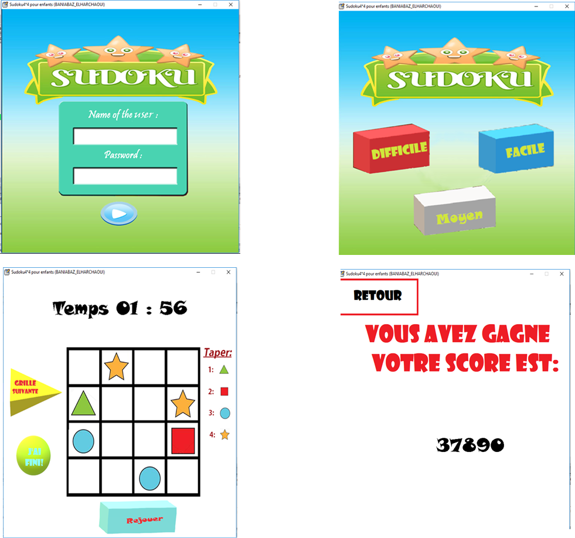

# Sudoku disktop game for children

This is the source code of a sudoku disktop game for children
## Developed by: Amina Baniabaz
## Year: 2018

## Programming languages used:
- C
- C++: barricade
- HTML, CSS, JavaScript: web dashboard

## Other technologies or libraries:
- OpenCV
- Numpy 

## The project consists of three parts: 
### Base station: 
is a Raspberry Pi3 based station to detect and track cars in the parking area and update the parking lots status accordingly. The parking area is divided into different zones as follows:

 The following images explain the state machine used to track the status of the parking lots:
 

## Rules of the game:
The rules of sudoku are very simple. The sudoku contains 4 rows and 4 columns, so 16 cells in total.
The goal of the game is to fill in these cells with one of the four figures (rectangle, square, circle, or triangle), always making sure that the same figure appears only once per column, once per row, and once per square of four cells.

